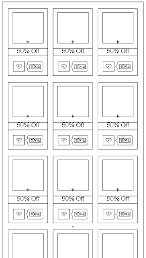

# PlayCoupons #

An web application covers some of the basic use cases for the coupon 
product, BluePromoCode, and makes use of their RESTful API endpoints.

### Requirements ###

Your mission is to write an app with the following screens:

 

The [design](design) folder for guidance.

1. Coupons:
  - Show coupons from our REST API
  - Resource: `http://api.bluepromocode.com/v2/promotions`
  - Method: `GET`

2. Login:
  - Login using our REST API
  - Resource: `http://api.bluepromocode.com/v2/users/login`
  - Method: `POST`
  - JSON Encoded Parameters: `email`, `password`
  - We have a test account you can use: email: `a@a.com`, password: `12345678`

3. Bonus - Signup:
  - Signup using our REST API
  - Resource: `http://api.bluepromocode.com/v2/users/register`
  - Method: `POST`
  - JSON Encoded Parameters: `fullName`, `email`, `password`

### Developing ###

This application is written in Scala with Play Framework, using IntelliJ IDEA.

### Running the code locally ###

1. Download this repository
2. `Import` the project into IntllijJ IDEA.
3. Enter `sbt run` to run the code.
4. Enter `http://localhost:9000/` in your browser.
